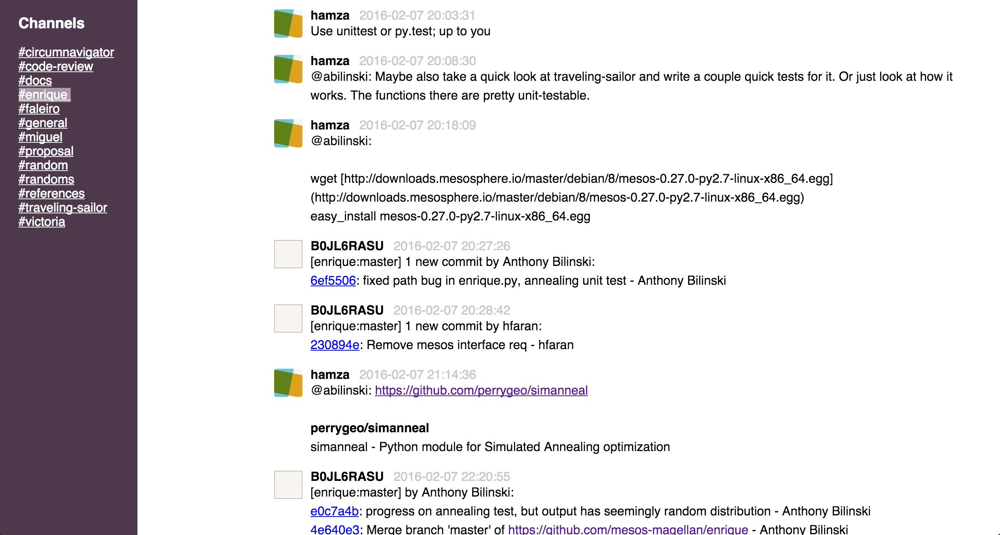

# Slack Dynamic Archive

A combination of Slack API and JSON conversion tools that allow one to
maintain an archive of slack message history and view it in an easy way.




## Overview
`dynamic-slack-archive` is designed to aid small teams that use the free version of slack
and need to view messages past the 10,000 limit. This tool both routinely listens for
then stores new messages from slack and creates a series of HTML files to view them when needed.

`dynamic-slack-archive` was designed for a team to host on an established website,
but could be used locally for yourself. Note that only Admin-level and above
can get the export and make the changes to use this tool.

## Installation
_I added a script, `install_all`, that you can use for steps 2 and 3_

### 1. Download this Repo to somewhere it will be kept

Clone this repo and go to the directory for the next steps

### 2. Install the converter

Use `pip` to install from the local folder
```bash
pip install ./slack-2-html
```

`slack-2-html` will be installed as an entry-point; run from anywhere.

```bash
$ slack-2-html --help
Usage: slack-2-html [OPTIONS]

Options:
  -z, --archive PATH Path to your export archive
                     [Required]
  --help             Show this message and exit.
```

### 3. Install the archive bot

Install using `pip`
```bash
pip install -r archive-bot/requirements.txt
```

### 4. Create archive bot

Create a new [bot user](https://api.slack.com/bot-users) on your slack
channel and get the API key for step 4 under Usage.


## Usage

### 1) Grab your Slack team's export

* Visit [https://my.slack.com/services/export](https://my.slack.com/services/export)
* Create an export
* Wait for it to complete
* Refresh the page and download the export (.zip file) into whatever directory

### 2) Make initial web pages

(This saves a step)
Point slack-2-html to the exported .zip archive
```bash
slack-2-html -z /path/to/slack-archive.zip
```

If it went well, two folders will be generated in the same directory
* one is the exported archive folder
* the other is a folder with HTML files to view with a browser

### 3) Import the archive into new database

Go to the directory of this install import the extracted archive:
```bash
python archive-bot/import.py /path/to/slack-archive
```
This will make a .sqlite file in the archive-bot folder
The bot will store new messages, users, and channels there

### 4) Start the archive bot

While in the install directory, replace <API_TOKEN> with your bot's unique api token:
```bash
export SLACK_API_TOKEN=<API_TOKEN> && python archive-bot/archivebot.py
```
The bot will now run in the background. Be careful not to let your machine sleep or
you will need to re-run this process.

### 5) Update archive as needed
_Note that I included a script to export and update these files as well_

To export the database into the file format for the converter, run this in the install folder:
```bash
python archive-bot/export.py archive-bot/slack.sqlite /path/to/slack-archive
```

Now you can repeat step 2 but use the /path/to/slack-archive as the arg. It would look like:
```bash
slack-2-html -z /path/to/slack-archive
```
The files will be replaced with an updated version

### Searching database in Slack

To search the archive, direct message (DM) @ArchiveBot with the search query.
For example, sending the word "pizza" will return the first 10 messages that
contain the word "pizza".  There are a number of parameters that can be provided
to the query.  The full usage is:

        <query> from:<user> in:<channel> sort:asc|desc limit:<number>

        query: The text to search for.
        user: If you want to limit the search to one user, the username.
        channel: If you want to limit the search to one channel, the channel name.
        sort: Either asc if you want to search starting with the oldest messages,
            or desc if you want to start from the newest. Default asc.
        limit: The number of responses to return. Default 10.

## Acknowledgments

Credit to Hamza Faran for the Flask app that I used as a starting point for the HTML generator
as well as credit to Jeremy Neiman for the original design of the archive bot
that makes continuous message tracking possible. Thanks guys!

## Contributing

Contributions are more than welcome.  From bugs to new features. I threw this
together to meet my team's needs, but there's plenty I've overlooked.

## License

Code released under the [MIT license](LICENSE).

### Improvements and changes in design

`dynamic-slack-archive` is a culmination of tools. It changes `slack-archive-viewer` into
an file generator, removing the flask app. This removes some functionality, but allowed for
my team to use it in our website for greater access. In summary, I added:

* Static file generation
* An archive export feature
* New user and channel handling in database
